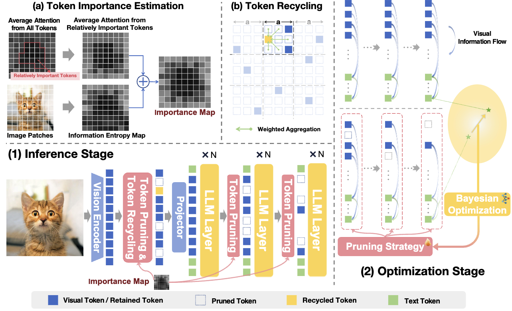

<div align="center">

# VFlowOpt: A Token Pruning Framework for LMMs with Visual Information Flow-Guided Optimization

</div>

<p align="center">
  <!-- <b>Authors</b><br> -->
  <a href="https://github.com/sihany077" target="_blank">Sihan Yang<sup>1</sup></a>,
  <a href="https://runsenxu.com" target="_blank">Runsen Xu<sup>1,2</sup></a>,
  <a href="https://gzcch.github.io/" target="_blank">Chenhang Cui<sup>3</sup></a>,
  <a href="https://tai-wang.github.io/" target="_blank">Tai Wang<sup>1†</sup></a>,
  <a href="http://dahua.site/" target="_blank">Dahua Lin<sup>1,2</sup></a>,
  <a href="https://oceanpang.github.io/" target="_blank">Jiangmiao Pang<sup>1†</sup></a>
</p>

<p align="center">
  <sup>1</sup>Shanghai AI Laboratory,
  <sup>2</sup>The Chinese University of Hong Kong,
  <sup>3</sup>National University of Singapore
</p>

<p align="center">
  <sup>†</sup>Corresponding Author
</p>


<p align="center">
  <a href="https://arxiv.org/pdf/2508.05211">📑 Paper</a>  |
  <a href="https://arxiv.org/abs/2508.05211">📖 arXiv</a>
</p>


## 🔔News


[2025-08-8]: We released our paper and codes.

[2025-07-11]: Our paper is accepted by ICCV 2025! 🎉


## Introduction
VFlowOpt is a novel, training-free token pruning framework designed to enhance the efficiency of Large Multimodal Models (LMMs) by addressing high computational costs from excessive visual tokens. It uniquely formulates pruning as an optimization problem, using a visual information flow-guided method to automatically find the best pruning strategy for different LMMs, thereby minimizing performance degradation. The framework features a more accurate token importance estimation by combining attention scores with image patch entropy, and it employs a progressive pruning strategy with a token recycling mechanism to preserve critical information. Experiments demonstrate that VFlowOpt can prune 90% of visual tokens while retaining 90% of the original performance, leading to an 89% reduction in KV-Cache memory and a 3.8x inference speedup.




## Quick Start

### Installation
```
git clone https://github.com/sihany077/VFlowOpt.git
cd VFlowOpt
conda create -n VFlowOpt python=3.10 -y
conda activate VFlowOpt
bash setup.sh
```

### Run Optimization
First, replace the dataset_path: in ```VFlowOpt/src/lmms_eval-0.2.4/lmms_eval/tasks/opt_data/opt_data.yaml``` with the directory where you downloaded the LLaVA-OneVision training data.

You can modify the codes marked "NOTE" in ```VFlowOpt/src/lmms_eval-0.2.4/lmms_eval/models/llava_ov_opt_all.py``` according to the number of layers in your model and your computational budget.
```
lmms-eval --model llava_ov_opt_all --model_args pretrained=pathTo/llava-onevision-qwen2-7b-ov,conv_template=qwen_1_5,model_name=llava_qwen_training_free,device_map=auto,enable_illava_vit=True,illava_vit_k=25,enable_illava_llm=True,illava_llm_k=9-18 --task opt_data --batch_size 1 --log_samples --log_samples_suffix llava_onevision_7b --output_path ./logs
```

### Run Evaluation
You can modify the pruning strategy in self.illava_config at line 141 of ```VFlowOpt/src/lmms_eval-0.2.4/lmms_eval/models/llava_onevision_training_free.py```. You can refer to the LMMs-Eval usage guide for more information.
```
lmms-eval --model llava_onevision_training_free --model_args pretrained=pathTo/llava-onevision-qwen2-7b-ov,conv_template=qwen_1_5,model_name=llava_qwen_training_free,device_map=auto,enable_illava_vit=True,illava_vit_k=25,enable_illava_llm=True,illava_llm_k=9-18 --task mmstar  --batch_size 1 --log_samples --log_samples_suffix llava_onevision_7b --output_path ./logs
```


<!-- ## 🔗 Citation

If you find our work and this codebase helpful, please consider starring this repo 🌟 and cite:

```bibtex
@article{yang2025mmsi,
  title={MMSI-Bench: A Benchmark for Multi-Image Spatial Intelligence},
  author={Yang, Sihan and Xu, Runsen and Xie, Yiman and Yang, Sizhe and Li, Mo and Lin, Jingli and Zhu, Chenming and Chen, Xiaochen and Duan, Haodong and Yue, Xiangyu and Lin, Dahua and Wang, Tai and Pang, Jiangmiao},
  journal={arXiv preprint arXiv:2505.23764},
  year={2025}
}
``` -->

## 📄 License

Shield: [![CC BY-NC 4.0][cc-by-nc-shield]][cc-by-nc]

This work is licensed under a
[Creative Commons Attribution-NonCommercial 4.0 International License][cc-by-nc].

[![CC BY-NC 4.0][cc-by-nc-image]][cc-by-nc]

[cc-by-nc]: https://creativecommons.org/licenses/by-nc/4.0/
[cc-by-nc-image]: https://licensebuttons.net/l/by-nc/4.0/88x31.png
[cc-by-nc-shield]: https://img.shields.io/badge/License-CC%20BY--NC%204.0-lightgrey.svg

## Acknowledgment
This repo benefits from [iLLaVA](https://github.com/hulianyuyy/iLLaVA), [LMMs-Eval](https://github.com/EvolvingLMMs-Lab/lmms-eval), and [LLaVA-OneVison](https://github.com/LLaVA-VL/LLaVA-NeXT). We thank these teams for their open-source contributions.

## Contact
- Sihan Yang: sihany077@gmail.com
